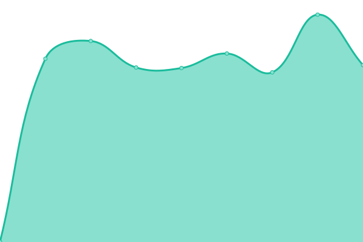
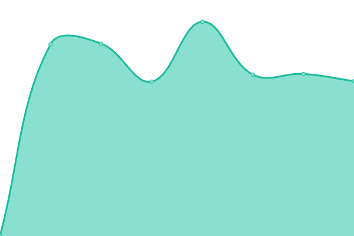

# [📈 Live Status](https://d35k.github.io/uptime-bot): <!--live status--> **🟧 Partial outage**

This repository contains the open-source uptime monitor and status page for [Göktuğ Hatipoğlu](https://d35k.github.io/uptime-bot), powered by [Upptime](https://github.com/upptime/upptime).

With [Upptime](https://upptime.js.org), you can get your own unlimited and free uptime monitor and status page, powered entirely by a GitHub repository. We use [Issues](https://github.com/d35k/uptime-bot/issues) as incident reports, [Actions](https://github.com/d35k/uptime-bot/actions) as uptime monitors, and [Pages](https://d35k.github.io/uptime-bot) for the status page.

<!--start: status pages-->
<!-- This summary is generated by Upptime (https://github.com/upptime/upptime) -->
<!-- Do not edit this manually, your changes will be overwritten -->
<!-- prettier-ignore -->
| URL | Status | History | Response Time | Uptime |
| --- | ------ | ------- | ------------- | ------ |
|  [Google](https://www.google.com) | 🟩 Up | [google.yml](https://github.com/d35k/uptime-bot/commits/HEAD/history/google.yml) | 

 88ms
     
 | 

<a href="https://d35k.github.io/uptime-bot/history/google">100.00%</a>
    

|  [Eczazone](https://eczazone.com) | 🟩 Up | [eczazone.yml](https://github.com/d35k/uptime-bot/commits/HEAD/history/eczazone.yml) | 

 1372ms
     
 | 

<a href="https://d35k.github.io/uptime-bot/history/eczazone">16.72%</a>
    

|  [Dermazone](https://dermazone.org) | 🟩 Up | [dermazone.yml](https://github.com/d35k/uptime-bot/commits/HEAD/history/dermazone.yml) | 

 2360ms
     
 | 

<a href="https://d35k.github.io/uptime-bot/history/dermazone">98.79%</a>
    

|  [KBBZone](https://kbbzone.com) | 🟥 Down | [kbb-zone.yml](https://github.com/d35k/uptime-bot/commits/HEAD/history/kbb-zone.yml) | 

 1629ms
     
 | 

<a href="https://d35k.github.io/uptime-bot/history/kbb-zone">10.48%</a>
    

|  [KVCZone](https://kvczone.com) | 🟩 Up | [kvc-zone.yml](https://github.com/d35k/uptime-bot/commits/HEAD/history/kvc-zone.yml) | 

 1621ms
     
 | 

<a href="https://d35k.github.io/uptime-bot/history/kvc-zone">17.35%</a>
    

|  [Psikezone](https://psikezone.com) | 🟩 Up | [psikezone.yml](https://github.com/d35k/uptime-bot/commits/HEAD/history/psikezone.yml) | 

 1707ms
     
 | 

<a href="https://d35k.github.io/uptime-bot/history/psikezone">98.76%</a>
    

|  [Ortopedizone](https://ortopedizone.com) | 🟥 Down | [ortopedizone.yml](https://github.com/d35k/uptime-bot/commits/HEAD/history/ortopedizone.yml) | 

 1101ms
     
 | 

<a href="https://d35k.github.io/uptime-bot/history/ortopedizone">5.95%</a>
    

|  [FTRZone](https://ftrzone.com) | 🟩 Up | [ftr-zone.yml](https://github.com/d35k/uptime-bot/commits/HEAD/history/ftr-zone.yml) | 

 2973ms
     
 | 

<a href="https://d35k.github.io/uptime-bot/history/ftr-zone">99.11%</a>
    

|  [Norozone](https://norozone.com) | 🟥 Down | [norozone.yml](https://github.com/d35k/uptime-bot/commits/HEAD/history/norozone.yml) | 

 1342ms
     
 | 

<a href="https://d35k.github.io/uptime-bot/history/norozone">13.10%</a>
    

<!--end: status pages-->

[**Visit our status website →**](https://d35k.github.io/uptime-bot)

## 📄 License

- Powered by: [Upptime](https://github.com/upptime/upptime)
- Code: [MIT](./LICENSE) © [Göktuğ Hatipoğlu](https://d35k.github.io/uptime-bot)
- Data in the `./history` directory: [Open Database License](https://opendatacommons.org/licenses/odbl/1-0/)
